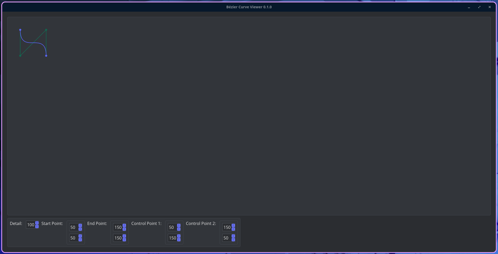
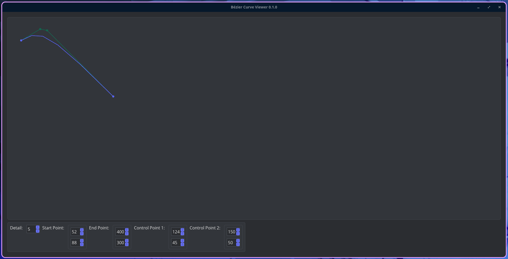
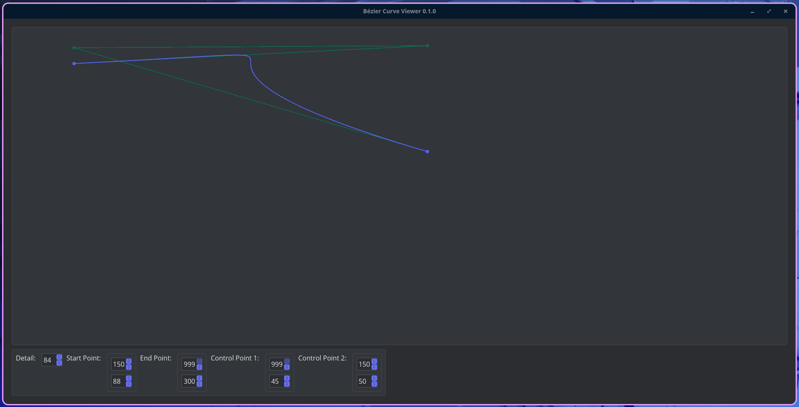

# Bézier Curve Viewer
This is a simple bézier curve viewer I made because I just learned about them in my maths class.

It isn't the greatest, but it is functional. I may update it in the future, IDK.

